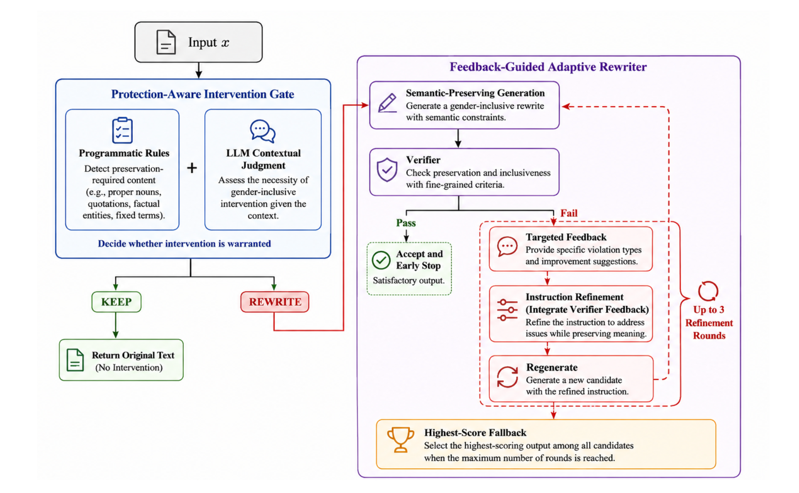

# PAIFAR

**PAIFAR** (Protection-Aware Intervention and Feedback-Guided Adaptive Rewriting) is a framework for measuring and mitigating **overcorrection in Chinese gender-inclusive generation**.

This repository contains the main PAIFAR implementation, including the **Protection-Aware Intervention Gate** and the **Feedback-Guided Adaptive Rewriter**.

**Main repository:** `gender_intervention_gate`  
**Companion evaluation repository:** [`over_correction_eval`](https://github.com/xskongai/over_correction_eval)

## Overview

PAIFAR separates **whether to intervene** from **how to rewrite**.

<p align="center">
  
</p>

```text
Input
  │
  ▼
Intervention Gate
  │
  ├── KEEP ──────► Original Text
  │
  └── REWRITE
          │
          ▼
Adaptive Rewriter
          │
          ▼
Verifier → Feedback → Refinement
          │
          ▼
      Final Output
```

> **Decide whether intervention is necessary before deciding how to rewrite.**

## Benchmark

**1,588 instances**

| Category | Count |
|---|---:|
| Golden-Positive | 871 |
| Golden-Negative | 717 |
| **Total** | **1,588** |

- **Golden-Positive:** intervention required.
- **Golden-Negative:** existing gender information should be preserved.

Across **11 language models**, zero-shot conditional rewriting produced an average **Overcorrection Rate of 65.28%** on the Golden-Negative set.

## Repository Structure

```text
gender_intervention_gate/
├── configs/          # Experiment configurations
├── data/             # Dataset and splits
├── docs/             # Documentation and figures
├── paper_results/    # Paper results
├── prompts/          # Prompts
├── runs/             # Experiment outputs
├── scripts/          # Experiment scripts
├── src/              # Main implementation
├── tests/             # Tests
├── .env.example
├── pyproject.toml
└── README.md
```

## Installation

```bash
git clone https://github.com/xskongai/gender_intervention_gate.git
cd gender_intervention_gate

python3 -m venv .venv
source .venv/bin/activate
pip install -e ".[dev]"
```

Create `.env` from `.env.example` and configure the required model/API credentials.

## Running

Experiment configurations are in `configs/` and scripts are in `scripts/`.

```bash
python scripts/run_experiment.py \
  --config configs/experiments/<experiment>.yaml
```

Run tests:

```bash
pytest
```

## Evaluation

PAIFAR supports evaluation of:

- **Intervention Gate**
- **Adaptive Rewriter**
- **End-to-end PAIFAR**
- **Overcorrection**

For systematic overcorrection evaluation and comparative experiments, see [`over_correction_eval`](https://github.com/xskongai/over_correction_eval).

## Citation

```bibtex
@inproceedings{kong2026paifar,
  title     = {PAIFAR: Measuring and Mitigating Overcorrection in Chinese Gender-Inclusive Generation},
  author    = {Kong, Xiaoshuang and others},
  booktitle = {Proceedings of SPELLL 2026},
  year      = {2026}
}
```
